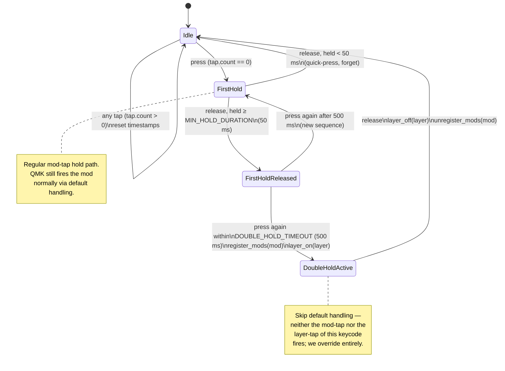
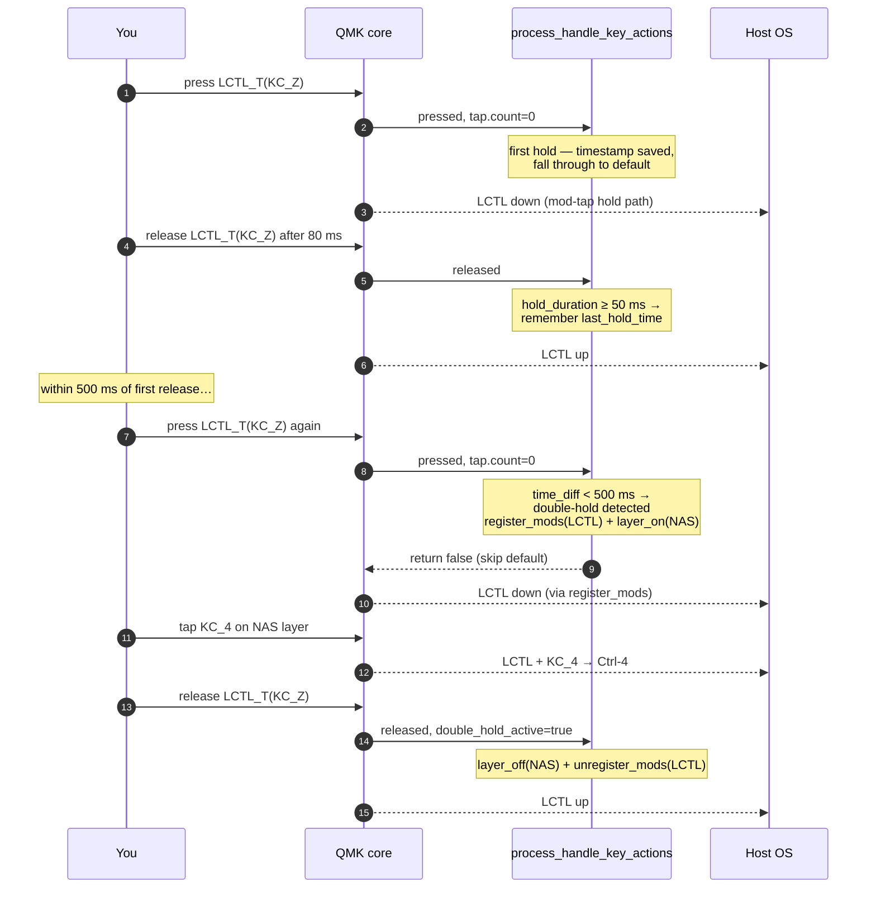

# Tour: `DOUBLE_HOLD_KEYS` — hold-twice-to-activate-numpad-with-mod

Living tour of the double-hold mechanic implemented in
[`keymap.c`](../keymap.c) lines 38–198. Complements the plain mod-tap and layer
behaviour with a "**hold, release, hold again quickly**" gesture that arms a
target layer *plus* a modifier for as long as the second hold is held.

## Why it exists

The default numpad layer (`NAS`, index 4) is entered by `MO(NAS)` on a thumb
key. That gives you numbers under the fingers, but it does not give you the
mod-modified numbers (`C-1` to switch tmux windows, `M-9` for browser tabs,
etc.) without also pressing a home-row mod. Pressing two mod-taps at once
usually resolves as taps (fast typing → letters).

Double-hold sidesteps that: hold a mod-tap once and *release*, then within
500 ms hold it again — the second hold now emits **mod + layer** for as long as
you keep it held. When you release, both come off.

Practical use: hold `LSFT_T(KC_M)` briefly, release, hold it again → Shift + NAS
layer active → tap `1` → produces `Shift-1` = `!`. Same trick with
`LCTL_T(KC_Z)` → Ctrl + NAS → `4` = `C-4`.

## Configured keys

The `DOUBLE_HOLD_KEYS` X-macro at [`keymap.c:125`](../keymap.c#L125) enumerates
every dual-role key that gets this treatment. Each entry records the wrapper
keycode, the tap keycode, the target layer, and the modifier bitmask to
register on double-hold.

Layer `4` (NAS) is the standard target. Layer `6` entries (`csg_q`, `cs_f`,
etc.) are left over from an earlier layout that had two numpad layers; they
still work but only if you have a layer 6 defined in `keymaps[]`.

## Mermaid diagrams

### State machine per key



### Timing example: "Ctrl+4 to switch tmux window 4"



### Interaction with QMK's tap-hold pipeline

```mermaid
flowchart TD
    A[Key event] --> B{keycode in<br/>DOUBLE_HOLD_KEYS?}
    B -- no --> Z[Default QMK<br/>tap/hold resolution]
    B -- yes --> C[process_handle_key_actions]
    C --> D{tap.count > 0?<br/>(QMK already decided<br/>this is a tap)}
    D -- yes --> R1[Clear DH state,<br/>return true → QMK sends tap]
    D -- no --> E{pressed?}
    E -- press --> F{last_hold_time set<br/>AND time_diff < 500ms?}
    F -- yes --> G[Double hold!<br/>register_mods + layer_on<br/>return false]
    F -- no --> H[Single hold,<br/>save press time,<br/>return true → default hold]
    E -- release --> I{double_hold_active?}
    I -- yes --> J[layer_off + unregister_mods<br/>return false]
    I -- no --> K{hold_duration ≥ 50ms?}
    K -- yes --> L[Save last_hold_time,<br/>return true → default release]
    K -- no --> M[Forget timestamp,<br/>return true]
```

**Key insight**: the double-hold logic only runs *after* QMK has decided the
event is a **hold** (`tap.count == 0`). If QMK decides it's a tap (via
`TAPPING_TERM`, `PERMISSIVE_HOLD`, `FLOW_TAP_TERM`, or `CHORDAL_HOLD`), the
code short-circuits to the "clear state, return true" path and behaves exactly
like a plain mod-tap tap. See [`ANALYSIS_double_hold_vs_flow_tap.md`](./ANALYSIS_double_hold_vs_flow_tap.md)
for how that composes with the other tap-hold features.

## Constants worth knowing

| Symbol | Value | Meaning |
|---|---|---|
| `DOUBLE_HOLD_TIMEOUT` | 500 ms | Max gap between first release and second press. |
| `MIN_HOLD_DURATION` | 50 ms | First press must be held at least this long to count as a "hold" for double-hold purposes. |
| `TAPPING_TERM` | Vial slider (typ. 200 ms) | Governs QMK's own tap-vs-hold decision. Double-hold does not override it. |
| `FLOW_TAP_TERM` | Vial slider (typ. 80–150 ms) | If the previous key was within this window, mod-tap resolves as tap and double-hold never sees a "hold" event to record. |

## Failure modes to watch for

- **First press too quick (< 50 ms)** → `MIN_HOLD_DURATION` filters it out;
  double-hold does not arm. Intentional — prevents rapid same-key retyping
  from accidentally engaging mods+layer.
- **Gap > 500 ms between presses** → treated as two independent single holds.
- **Flow Tap force-tapped the first press** → `tap.count > 0`, no
  `last_hold_time` recorded, so a second press within 500 ms is just a fresh
  first-hold, not a double-hold.

## Related files

- [`keymap.c`](../keymap.c) — implementation and `DOUBLE_HOLD_KEYS` table.
- [`ANALYSIS_double_hold_vs_flow_tap.md`](./ANALYSIS_double_hold_vs_flow_tap.md) — interaction analysis.
- [`../README.org`](../README.org) — top-level keymap docs.
